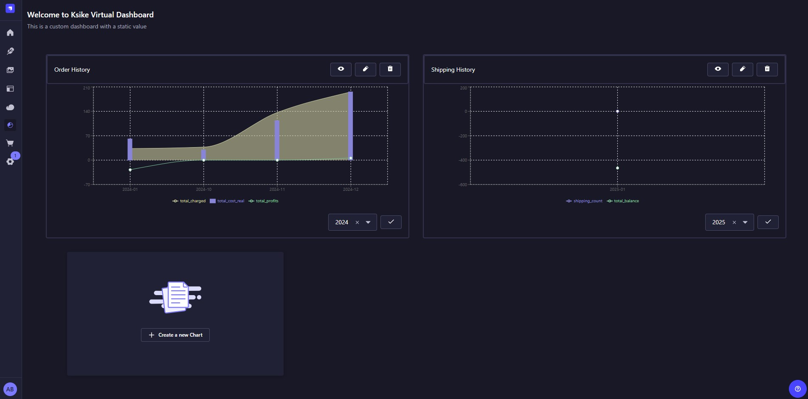
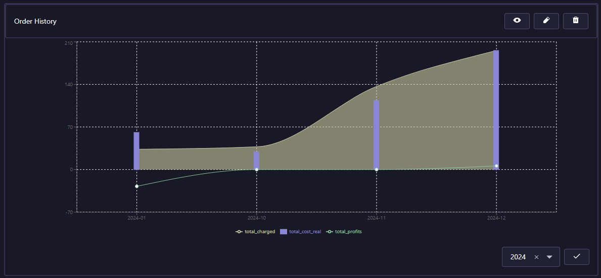
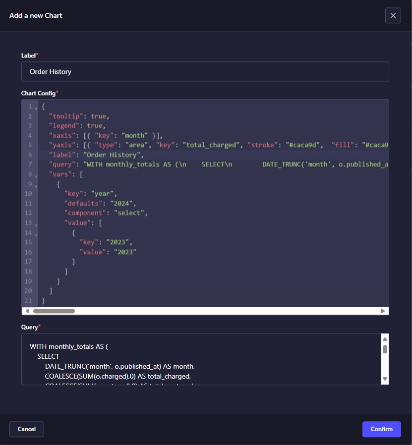
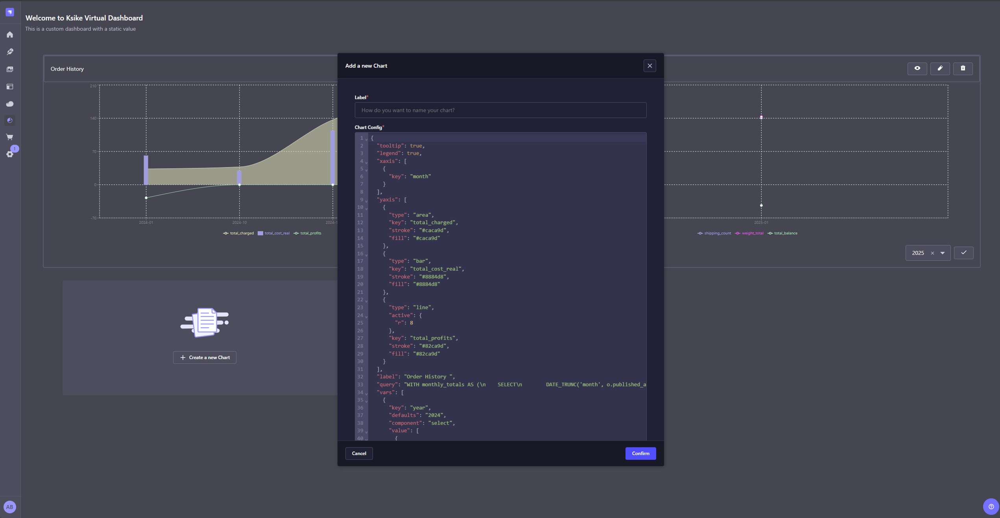

StpDasboard is a plugin that allows you to visualize a dashboard in Strapi with multiple charts, including Bar, Line, Area, and more. This plugin enhances the Strapi admin panel by providing a comprehensive and customizable interface for displaying various types of data visualizations. With Ksdasboard, you can easily create and manage dashboards to monitor key metrics and insights directly within your Strapi environment.

🎉 Supports Strapi version 5 🎉



**Key Features of StpDasboard:**
1. Multiple Chart Types:
    - Supports various chart types such as Bar, Line, Area, Pie, and more.
    - Allows you to choose the best visualization for your data.

2. Customizable Dashboards:
    - Create and customize multiple dashboards to suit your needs.
    - Arrange and resize charts to create an optimal layout.

3. Real-Time Data:
    - Visualize real-time data updates to keep your dashboards current.
    - Connect to different data sources to fetch and display data dynamically.

4. User-Friendly Interface:
    - Intuitive interface for adding, editing, and managing charts.
    - Easy-to-use configuration options for each chart type.

5. Integration with Strapi:
    - Seamlessly integrates with Strapi's admin panel.
    Utilizes Strapi's content management capabilities to fetch and display data.

## Install & Configure
To install and configure the StpDasboard plugin for Strapi, follow these steps:
1. Open your terminal and navigate to your Strapi project directory. 
2. Run the following command to install the StpDasboard plugin:
    ```shell
    npm i strapi-plugin-dashboard
    ```
3. Update the Plugin Configuration File:
    - Navigate to the `config\plugins.ts` file in your Strapi project.
    - Add the following code to configure the StpDasboard plugin:
        ```ts
        const { PLUGIN_STPDASHBOAD = false } = process.env;

        const plugins = {};

        if (PLUGIN_STPDASHBOAD) {
            plugins["strapi-plugin-dashboard"] = { enabled: true };
        }
        export default () => (plugins);
        ```
Explanation:
- The `PLUGIN_STPDASHBOAD` environment variable is used to determine whether the virtval plugin should be enabled. If this variable is set to true, the plugin will be enabled.
- The plugins object is used to configure Strapi plugins.
- If `PLUGIN_STPDASHBOAD` is true, the virtval plugin is added to the plugins object with the enabled property set to true.
- To enable the virtval plugin, you need to set the `PLUGIN_STPDASHBOAD` environment variable to true. This can be done in your `.env` file or directly in your environment.
    ```
    PLUGIN_STPDASHBOAD=true
    ```
- Once the environment variable is set and the server is restarted, the virtval plugin will be enabled and ready to use.

By following these steps, you can successfully install and configure the virtval plugin in your Strapi project, allowing you to take advantage of its features for rendering and managing values dynamically.


## How It Works
One of the most powerful features of StpDasboard is its ability to represent multiple data points in a single chart using different visualization types such as Lines, Areas, Bars, and more. This flexibility allows users to create rich, informative dashboards that can display complex datasets in an intuitive and visually appealing way. Additionally, the plugin provides a user-friendly graphical interface for editing chart configurations, including the JSON structure, SQL queries, and chart titles. Let’s dive into how this works.



### Graphical Interface for Chart Configuration
StpDasboard provides an intuitive graphical interface within the Strapi admin panel for editing and managing charts. 

1. **Editing Chart Configuration**: The interface allows users to modify the JSON configuration directly or through form-based inputs. For example:
    - **Chart Title**: Users can edit the label field to change the chart’s title.
    - **X-Axis** and **Y-Axis**: Users can add or remove data series, change visualization types, and customize colors.
    - **Tooltips** and **Legends**: Users can enable or disable tooltips and legends using toggle switches

2. **Editing SQL Queries**: For advanced users, the interface provides a code editor to modify the SQL query associated with the chart. This is particularly useful for:
    - Adding filters or parameters.
    - Joining multiple tables.
    - Writing complex queries with subqueries or CTEs (Common Table Expressions).

3. **Visualizing Data**: The interface includes a preview panel where users can see the chart update in real-time as they make changes to the configuration or query. This ensures that the chart looks exactly as intended before saving.

4. **Full-Screen Mode**: Users can expand a chart to full-screen mode for a more detailed view. This is especially useful when presenting data to stakeholders or analyzing large datasets.

5. **Deleting Charts**: If a chart is no longer needed, users can easily delete it from the dashboard. A confirmation dialog ensures that accidental deletions are avoided.

## Configuration
StpDasboard uses a JSON configuration file (`config/charts.json`) to define the charts and dashboards. This file allows you to specify the chart types, data sources, and other customization options. Below is an example of how you can configure your charts using this file:



### JSON Schema for Chart Configuration
The `config/charts.json` file is a list of graphical objects, where each object represents a chart. Below is a generalized JSON Schema that describes the structure of each chart object:

```json
{
  "type": "array",
  "items": {
    "type": "object",
    "properties": {
      "id": {
        "type": "string",
        "description": "A unique identifier for the chart."
      },
      "name": {
        "type": "string",
        "description": "The name of the chart."
      },
      "tooltip": {
        "type": "boolean",
        "description": "Enables or disables tooltips for the chart."
      },
      "legend": {
        "type": "boolean",
        "description": "Enables or disables the legend for the chart."
      },
      "xaxis": {
        "type": "array",
        "items": {
          "type": "object",
          "properties": {
            "key": {
              "type": "string",
              "description": "The key for the X-axis data (e.g., time, category)."
            }
          },
          "required": ["key"]
        },
        "description": "Defines the X-axis data for the chart."
      },
      "yaxis": {
        "type": "array",
        "items": {
          "type": "object",
          "properties": {
            "type": {
              "type": "string",
              "enum": ["bar", "line", "area", "pie"],
              "description": "The type of chart (e.g., Bar, Line, Area, Pie)."
            },
            "key": {
              "type": "string",
              "description": "The key for the Y-axis data."
            },
            "stroke": {
              "type": "string",
              "description": "The stroke color for the chart."
            },
            "fill": {
              "type": "string",
              "description": "The fill color for the chart."
            },
            "active": {
              "type": "object",
              "properties": {
                "r": {
                  "type": "number",
                  "description": "The radius of active points (used in Line charts)."
                }
              }
            }
          },
          "required": ["type", "key"]
        },
        "description": "Defines the Y-axis data and chart type."
      },
      "label": {
        "type": "string",
        "description": "The label for the chart."
      },
      "query": {
        "type": "string",
        "description": "The SQL query used to fetch data for the chart."
      },
      "vars": {
        "type": "array",
        "items": {
          "type": "object",
          "properties": {
            "key": {
              "type": "string",
              "description": "The key for the variable."
            },
            "defaults": {
              "type": "string",
              "description": "The default value for the variable."
            },
            "component": {
              "type": "string",
              "description": "The UI component for the variable (e.g., select, input)."
            },
            "value": {
              "type": "array",
              "items": {
                "type": "object",
                "properties": {
                  "key": {
                    "type": "string",
                    "description": "The key for the variable option."
                  },
                  "value": {
                    "type": "string",
                    "description": "The value for the variable option."
                  }
                }
              }
            }
          },
          "required": ["key", "defaults", "component"]
        },
        "description": "Variables used in the query (e.g., filters, parameters)."
      }
    },
    "required": ["id", "xaxis", "yaxis", "label", "query"]
  }
}
```

**Explanation of the Configuration:**
- **id:** A unique identifier for each chart.
- **name:** The name of the chart.
- **tooltip:** Enables or disables tooltips for the chart.
- **legend:** Enables or disables the legend for the chart.
- **xaxis:** Defines the X-axis data, typically a time series or category.
- **yaxis:** Defines the Y-axis data, including the type of chart (e.g., Bar, Line, Area) and the data key.
- **label:** The label for the chart.
- **query:** The SQL query used to fetch the data.
- **vars:** Variables that can be used in the query, such as filters or parameters.

### Simplified Example
Here’s a simplified example of a `config/charts.json` file with a single chart:
```json
[
  {
    "id": "123456789",
    "name": "sales",
    "tooltip": true,
    "legend": true,
    "xaxis": [
      {
        "key": "month"
      }
    ],
    "yaxis": [
      {
        "type": "bar",
        "key": "total_sales",
        "stroke": "#8884d8",
        "fill": "#8884d8"
      }
    ],
    "label": "Monthly Sales",
    "query": "SELECT TO_CHAR(order_date, 'YYYY-MM') AS month, SUM(sales) AS total_sales FROM orders GROUP BY month ORDER BY month;",
    "vars": []
  }
]
```
The SQL query could be as complex as necessary:
```sql
SELECT TO_CHAR(order_date, 'YYYY-MM') AS month, 
       SUM(sales) AS total_sales, 
       SUM(profits) AS total_profits 
FROM orders 
GROUP BY month 
ORDER BY month;
```

Explanation:
- This configuration defines a single chart that displays monthly sales data.
- The X-axis represents the month, and the Y-axis represents the total_sales.
- The chart type is a Bar chart.
- The SQL query is simple: it groups sales data by month and calculates the total sales for each month.

### Complex Query Example
For more advanced use cases, you can use complex SQL queries with joins, subqueries, and variables. Here’s an example based on the original configuration:

```json
[
  {
    "id": "1735854711217",
    "tooltip": true,
    "legend": true,
    "xaxis": [
      {
        "key": "month"
      }
    ],
    "yaxis": [
      {
        "type": "line",
        "key": "shipping_count",
        "stroke": "#8884d8"
      },
      {
        "type": "line",
        "key": "weight_total",
        "stroke": "#d811d8"
      }
    ],
    "label": "Shipping History",
    "query": "WITH package_data AS (SELECT s.id AS shipping_id, COALESCE(SUM(p.weight), 0) AS weight_total FROM public.packages AS p INNER JOIN public.packages_shipping_lnk AS ps ON ps.package_id = p.id INNER JOIN public.shippings AS s ON s.id = ps.shipping_id WHERE EXTRACT(YEAR FROM s.published_at) = :year GROUP BY s.id) SELECT TO_CHAR(DATE_TRUNC('month', s.published_at), 'YYYY-MM') AS month, COUNT(DISTINCT s.id) AS shipping_count, COALESCE(SUM(pd.weight_total), 0) AS weight_total FROM public.shippings AS s LEFT JOIN package_data AS pd ON pd.shipping_id = s.id WHERE EXTRACT(YEAR FROM s.published_at) = :year GROUP BY DATE_TRUNC('month', s.published_at) ORDER BY DATE_TRUNC('month', s.published_at);",
    "vars": [
      {
        "key": "year",
        "defaults": "2024",
        "component": "select",
        "value": [
          {
            "key": "2023",
            "value": "2023"
          },
          {
            "key": "2024",
            "value": "2024"
          }
        ]
      }
    ]
  }
]
```

The SQL query could be as complex as necessary:

```sql
WITH monthly_data AS (
  SELECT 
    DATE_TRUNC('month', order_date) AS month,
    SUM(sales) AS total_sales,
    SUM(profits) AS total_profits,
    SUM(costs) AS total_costs
  FROM orders
  WHERE EXTRACT(YEAR FROM order_date) = :year
  GROUP BY DATE_TRUNC('month', order_date)
)
SELECT 
  TO_CHAR(month, 'YYYY-MM') AS month,
  total_sales,
  total_profits,
  total_costs
FROM monthly_data
ORDER BY month;
```

Explanation: 
- This chart displays shipping history, including the number of shipments (`shipping_count`) and total weight (weight_total) per month.
- The query uses a Common Table Expression (CTE) to calculate the total weight of packages for each shipment.
- The vars section allows the user to select a year (`2023` or `2024`) to filter the data.


### Representing Multiple Data Points in a Single Chart
In StpDasboard, a single chart can display multiple datasets, each represented by a different visualization type. This is achieved through the yaxis property in the JSON configuration. Each entry in the yaxis array defines a dataset and its corresponding visualization type. For example:

```json
{
    // ...
    "yaxis": [
        {
            "type": "line",
            "key": "total_sales",
            "stroke": "#8884d8"
        },
        {
            "type": "area",
            "key": "total_profits",
            "stroke": "#82ca9d",
            "fill": "#82ca9d"
        },
        {
            "type": "bar",
            "key": "total_costs",
            "stroke": "#ff8042",
            "fill": "#ff8042"
        }
    ]
    // ...
}
```

Explanation:
- **type:** Specifies the visualization type (e.g., `line`, `area`, `bar`).
- **key:** The key in the dataset that corresponds to this data series.
- **stroke:** The color of the line or border for the visualization.
- **fill:** The fill color for visualizations like Area charts.

In this example:
- **total_sales** is represented as a **Line**.
- **total_profits** is represented as an **Area**.
- **total_costs** is represented as a **Bar**.



With the generalized JSON Schema and examples provided, you can now better understand how to configure and use StpDasboard for your Strapi projects. Whether you need a simple chart or a complex dashboard with advanced queries, StpDasboard offers the flexibility and power to meet your data visualization needs. Start building your dynamic dashboards today!

## Similar Plugin
- [VirtVal Plugin](https://www.npmjs.com/package/virtval): Strapi plugin to add a field with a virtual or external value to an existing Content-Type, [find it at Strapi Market](https://market.strapi.io/plugins/virtval).

## Conclusion

StpDasboard is a powerful addition to the Strapi ecosystem, providing developers and content managers with the tools they need to create dynamic, customizable dashboards. With support for multiple chart types, real-time data, and seamless integration with Strapi, StpDasboard is the ultimate solution for data visualization in your Strapi projects.

Whether you're building a simple dashboard for internal use or a complex data visualization for your users, StpDasboard makes it easy to bring your data to life. Start using StpDasboard today and take your Strapi experience to the next level!